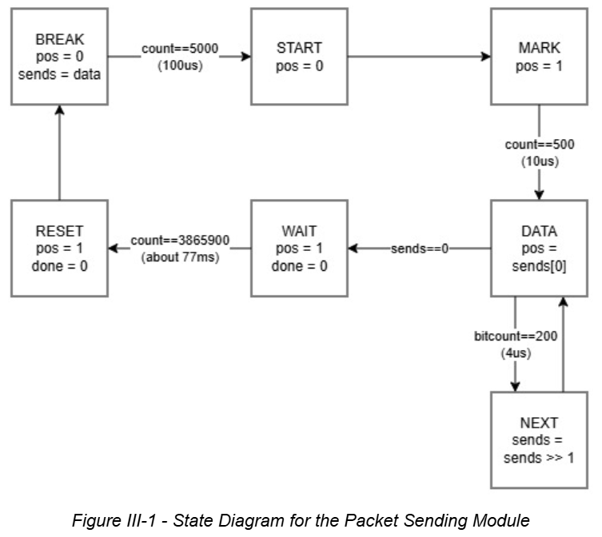
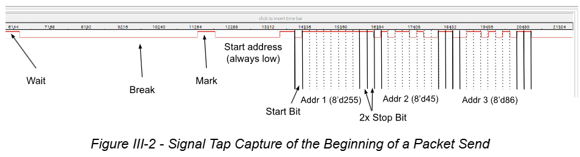
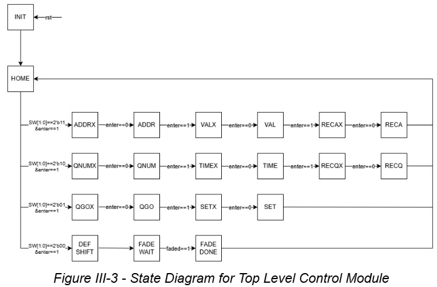

# FPGA Light Board

<b>ECE287 Final Project - Advised by Dr. Peter Jamieson 
Authors: Marissa Shewmaker, Shane Werthaiser</b>

## Section I - Project Description

[put text here]

## <b>Section II - Background Information</b>

DMX512 (Digital Multiplex) is the standard protocol used for controlling stage lighting and effects. A single DMX “universe” consists of a packet of 512 bytes of information. The standard structure of the packet begins with a “break” and a “mark-after-break,” which is then followed by up to 512 frames of data. In each data frame, there consists of a start bit (low), eight data bits (representing a value from 0 to 255), and two stop bits (high). DMX protocol requires the least significant bit (LSB) to be first. 

## Section III - Design Description

### Data Send Algorithm - 
The DMX data being sent is stored in a 5643 bit array (513 addresses of a low start bit, eight data bits, and two high stop bits).  The start and stop bits are hard coded into the array and always remain unaltered.  The data bits are modifiable through the board controls (discussed later).  

Packets are sent using a timing module that ensures that delays and output levels are appropriate.  The algorithm for the data sending itself is simple and just sets a “send” array equal to the data array, then sends the least significant bit for four microseconds before shifting the array one bit to the right and repeating the process until the array is equal to zero (which always occurs only after the last bit because the last bit is a high “stop” bit).  The cycle then delays for an amount of time to give the full packet cycle a length of about 100 milliseconds.

Below in figure III-1 is a state diagram for the packet send algorithm, and shows the output signal in each state.  Note that state transitions are clocked with a 50 MHz clock, and it can be assumed that in any case where a state does not meet the listed transition requirement, the state progresses to itself.  Also note that not all counters are notated, but they can be assumed to exist.

The resulting output signal was captured in a signal tap simulation below in figure III-2.  The time scales from left to right in increments of 0.02 microseconds.  Note that DMX protocol sends and receives bits from least to most significant, so unlike how an array is written, the sent data is reversed (last in, first out).  Each phase of the cycle is labeled in the figure, including the end of the wait cycle from the previous bit.  The recorded values of the first three addresses are also labeled and visible in the data signal.  Address four and onward are all zero.

### System Control -
The board is controlled by switch and key inputs.  The switches are used for all data entry and selection, and the keys are used for confirming selections.  The control system itself is a finite state machine that idles in a home state, and can proceed to four different control processes depending on the state of switches zero and one when the data entry is confirmed.  The four functionalities are recording an address value, recording a cue, restoring a cue, and fading to the next cue.  This procedure can be visualized below in figure III-3 which represents the state diagram for the top-level control module.  The same assumptions made for the packet diagram can be made here.

Most states are implemented twice in order to account for the length of a human button press.  A list of the individual state functionalities are below.  Assume that any state listed as “STATEX” has the same functionality as STATE and serves only as a buffer unless noted otherwise.
