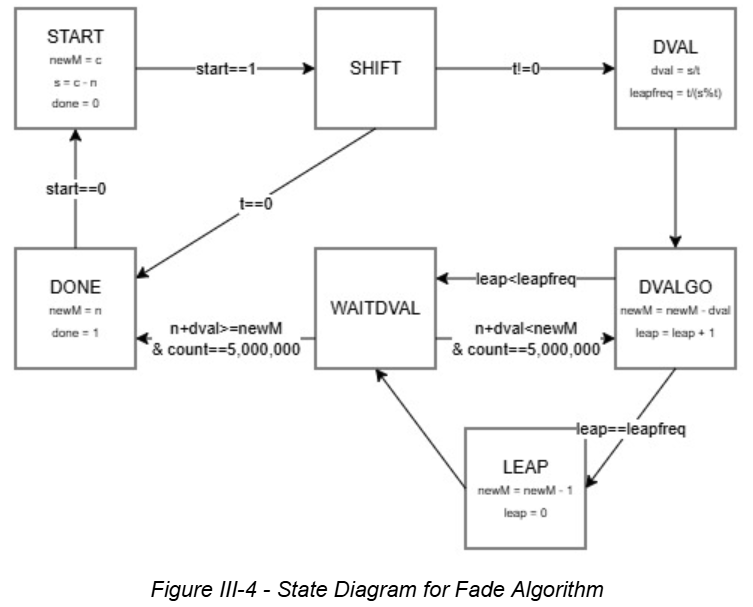

# FPGA Light Board

<b>ECE287 Final Project - Advised by Dr. Peter Jamieson 
Authors: Marissa Shewmaker, Shane Werthaiser</b>

## Section I - Project Description

[put text here]

## <b>Section II - Background Information</b>

DMX512 (Digital Multiplex) is the standard protocol used for controlling stage lighting and effects. A single DMX “universe” consists of a packet of 512 bytes of information. The standard structure of the packet begins with a “break” and a “mark-after-break,” which is then followed by up to 512 frames of data. In each data frame, there consists of a start bit (low), eight data bits (representing a value from 0 to 255), and two stop bits (high). DMX protocol requires the least significant bit (LSB) to be first. 

## Section III - Design Description

### Data Send Algorithm - 
The DMX data being sent is stored in a 5643 bit array (513 addresses of a low start bit, eight data bits, and two high stop bits).  The start and stop bits are hard coded into the array and always remain unaltered.  The data bits are modifiable through the board controls (discussed later).  

Packets are sent using a timing module that ensures that delays and output levels are appropriate.  The algorithm for the data sending itself is simple and just sets a “send” array equal to the data array, then sends the least significant bit for four microseconds before shifting the array one bit to the right and repeating the process until the array is equal to zero (which always occurs only after the last bit because the last bit is a high “stop” bit).  The cycle then delays for an amount of time to give the full packet cycle a length of about 100 milliseconds.

Below in figure III-1 is a state diagram for the packet send algorithm, and shows the output signal in each state.  Note that state transitions are clocked with a 50 MHz clock, and it can be assumed that in any case where a state does not meet the listed transition requirement, the state progresses to itself.  Also note that not all counters are notated, but they can be assumed to exist.

The resulting output signal was captured in a signal tap simulation below in figure III-2.  The time scales from left to right in increments of 0.02 microseconds.  Note that DMX protocol sends and receives bits from least to most significant, so unlike how an array is written, the sent data is reversed (last in, first out).  Each phase of the cycle is labeled in the figure, including the end of the wait cycle from the previous bit.  The recorded values of the first three addresses are also labeled and visible in the data signal.  Address four and onward are all zero.

### System Control -
The board is controlled by switch and key inputs.  The switches are used for all data entry and selection, and the keys are used for confirming selections.  The control system itself is a finite state machine that idles in a home state, and can proceed to four different control processes depending on the state of switches zero and one when the data entry is confirmed.  The four functionalities are recording an address value, recording a cue, restoring a cue, and fading to the next cue.  This procedure can be visualized below in figure III-3 which represents the state diagram for the top-level control module.  The same assumptions made for the packet diagram can be made here.

Most states are implemented twice in order to account for the length of a human button press.  A list of the individual state functionalities are below.  Assume that any state listed as “STATEX” has the same functionality as STATE and serves only as a buffer unless noted otherwise.

_Miscellaneous Operational States_
- HOME: No functionality other than being an idle state.
- INIT: Set initial parameters for temporary and output variables.
  
_Recording an address value_
- ADDR: Select the address to be modified (1 to 511).  Values are confirmed upon the next “enter” press.
- VAL: Select the value to be assigned to the chosen address (0 to 255).  Values are confirmed upon the next “enter” press.
- RECA: Address value is stored in the data array.
  
_Recording a Cue_
- QNUM: Select the cue number to which the current data array will be written (0 to 4).  Values are confirmed upon the next “enter” press.
- TIME: Select the amount of time a fade into this cue should take (0 to 1023).  Note that this value is in tenths of a second.  Values are confirmed upon the next “enter” press.
- RECQ: The current data array is stored in an array corresponding to the selected cue, and an indicator turns on to confirm that a cue has been written in this cue slot.
  
_Restoring a Cue_
- QGO: Select the cue data to be restored (0 to 4).  Values are confirmed upon the next “enter” press.
- SET: The data array is set equal to the corresponding cue array.  If no cue is recorded, the restored data will be the same as an empty data array.
  
_Fading to Next Cue_
- DEFSHIFT: Determines the next written cue and defines the parameters for the fade of each address, the fade time for that cue, and sends a high signal to the fade algorithm start bit.
- FADEWAIT: System sets data equal to the data outputted from the fade module (discussed in the following subsection).
- FADEDONE: System disables the start bit for the fade algorithm and sets the data bits equal to the final outputted value.

For a demonstration of each of these features, see the video linked [here](https://youtu.be/9XPXB9ixPZg?si=M2DyAFkIymhKrx6g).

### Fade Algorithm - 
The fade algorithm operates independently to the other modules, and independently for each data address.  The algorithm takes in the current value of the address, the value of the address in the destination cue, and the time of the fade.  It outputs a byte of data initially equal to the current address value, and continuously shifts it over the fade time.  To determine the amount by which to shift the value, the algorithm first determines the total change in value, then divides that change by the time over which the fade occurs (in tenths of a second).  Then, it subtracts that amount, called “dval”, from the output value every tenth of a second until the difference between the output value and the intended final value is less than dval.  

This timing is further refined by incrementing by an additional “leap second” every few increments.  This frequency is determined by dividing the time over which the fade occurs by the remainder of the previous division.

As an example, take an initial value of 250 and a final value of 0 over the course of 10 seconds (time equals 100).  The initial division would give a dval of 2 (250/100), and the leap frequency would be once every two increments (100/50).  This means that the algorithm will increment by -2, -3, -2, -3, and so on until eventually the output equals 0.

A state diagram of the process can be seen in figure III-4 below.  The same assumptions made for other diagrams remain true.  

Note that the leapfreq calculation will only be done if the remainder does not equal zero.  If it does, the leap frequency variable is made as large as possible which eliminates the possibility of the leap ever occurring for that fade.  Also note that the “DONE” state can only reset to the “START” state once the start signal is turned off, and that in figure III-3, though not explicitly shown, the “FADEWAIT” state can only progress to the “FADEDONE” state when all fade modules output a high “done” bit, and that the start bit for all fade modules is only turned low once the top level control module proceeds to the “FADEDONE” state.  This avoids any possibility of the system advancing before a fade is fully complete.

For a demonstration of several address fades occurring at once within the packet signal, see the video linked [here](https://youtu.be/9XPXB9ixPZg?si=M2DyAFkIymhKrx6g).  For a demonstration of a single address fade occurring within the packet signal, as well as numerically, see the video linked in the “System Control” subsection.

## Section IV - Possible Improvements
While the current project is capable of sending a full universe of 512 addresses, the modification and entry tools only function for the first five addresses.  This could be expanded to accommodate up to 511 addresses using a simple script generator, some samples of which can be found [here], although they drastically increase the computational requirements of the system.  The method could be condensed by instead calling to, modifying, and storing variable addresses within a memory file, although this version uses only registers.

Additionally, the fading algorithm is currently limited to fading down, but using a simple if/else branch on the state diagram, the system could be rigged to add dval instead of subtract if a fade up was necessary.

Lastly, it is important to note that the output signal only works in theory.  With the available resources, we were unable to actually send data physically to a light fixture, although the packet follows the typical DMX protocol, so with proper connection, it should theoretically work.

## Section V - Conclusion

The project successfully demonstrated the logic required to implement a DMX512 controller on an FPGA. The system functionality was verified through Signal Tap logic analysis in Quartus, which confirmed that the output signal was sent correctly and follows DMX timing protocols. 

While the logic was implemented correctly, there are specific limitations and areas for future improvement as discussed in Section IV.

## Section VI - References and Resources

